    * Author: Haowei Chen
    * Co-Author: Pin-Yi Yu
    * Description of hardware: (windows, Adafruit 938 OLED Screen with I2C Interface, SAMW25 Module, Force Sensor with I2C Interface, Temprature/Humidity Sensor sensor with I2C, Electromagnetic Locking Lid with Spring Open Mechanism, buck converter, boost converter) 

## 1. Video Presentation

- [Video Presentation](https://youtu.be/nQqyR8lDyXY?si=AE45nUH7O6IaNKej)

## 2. Project Summary

### Device Description

- The Magic Pill Box is designed to help elderly people who are not familiar with phone and tablet devices to aid their medication. The solution is using an IOT device and remote access. 

### Inspiration

- My grandparents are diagnosed with high blood pressure and are taking medicine on a daily basis. However, they keep forgetting to take the pills. First, me and my parents would give them a call to remind them, and they still forget to take the pill after hanging up the phone. We eventually bought them a smart pill box, but they are not so familiar with the setup, and still not working as we expected. This is when I came up with the idea of Magic Pill Box. 

### Device Functionality

- The Magic Pill Box is made with a few interesting functions. First of all, the safe lock function which is integrated with 3 electric magnets and a buzzer. When the buzzer is beeping, it reminds the user to take the pill and based on the number on the OLED screen, the user will need to take the pills from the corresponding compartment. Before taking the pills, the user needs to press the switch to open the compartment by unlocking the electric magnets. Once the user eats the pills and closes the lid, the lid will then press the button sticked inside the compartment and shut off the buzzer. 

- The Magic Pill Box is also equipped with the SHTC3 temperature and humidity sensor, and the purpose is to monitor the storage condition. If there's an anonymous reading, the buzzer will start beeping and send the user a notification that the storage condition is dangerous to the medicine.

- The user can use the node-red system to set up the alarm schedule and change the storage condition threshold.

### Challenges

- There are many challenges during the development. The first challenge we ran into was debugging the hardware issue, which had something to do with the component on the circuit board. For example, we were stuck on the I2C device development for almost 2 weeks and turned out to be a pin mapping error. The second challenge was developing firmware. Since we needed to write all freeRTOS drivers to our sensors, it took us a while to test and debug. The last challenge was casework design. I spent a lot of time on modifying the 3D design of the casework and had to print multiple prototypes to test the device and printing something out really took a lot of time. 

### Prototype Learnings

- The biggest lesson I learned from this project was to start things early and avoid sudden changes in design. The other thing I think we can improve is start casework design based on the firmware, and not the other way around. I spent a lot of time on how to make a perfect casework to fit my hardware, and in the end, it turned out there were lots of things that needed to be modified.

### Next Steps

- In the future, I am planning a two-phase update on this device using over-the-air updates. First, I want to add more information to the screen(time/temperature/humidity). Next, I will add a UI function in which the user can set the schedule and change the storage condition threshold directly on the user interface. 

## 3. Hardware & Software Requirements

## 4. Project Photos & Screenshots

### Casework

- 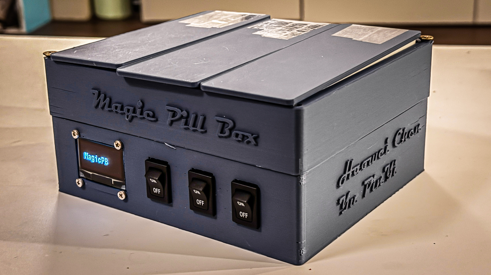
- 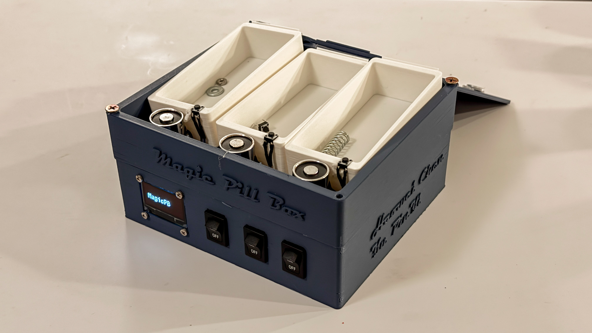

### a. The standalone PCBA, top

- 

### b. The standalone PCBA, bottom

- 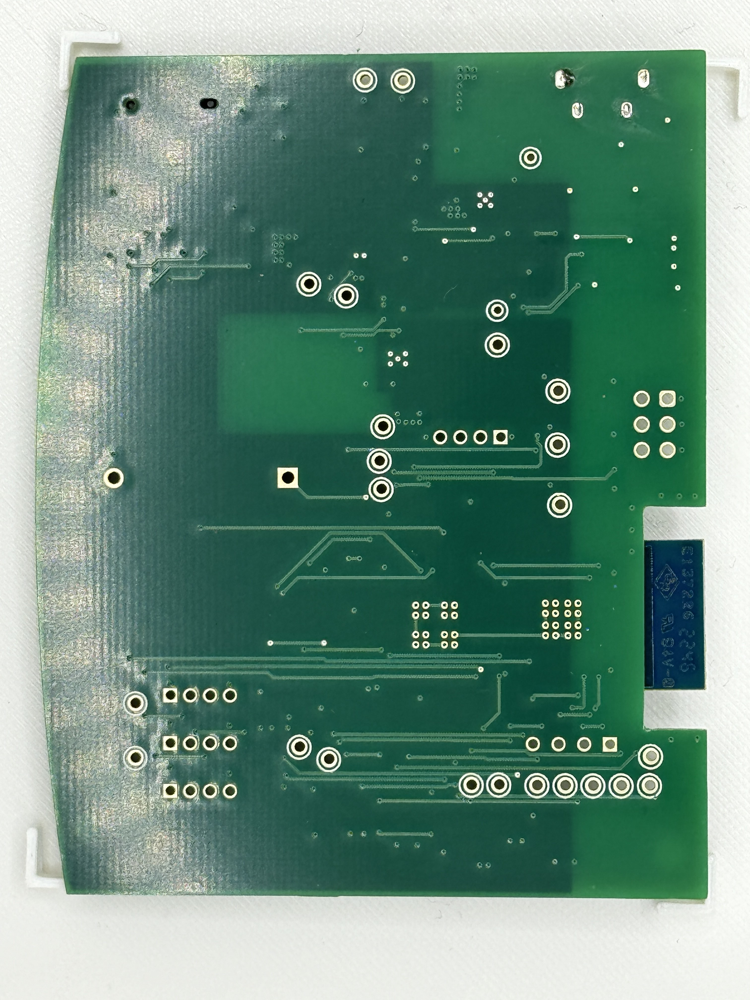

### c. Thermal camera images while the board is running under load 

- 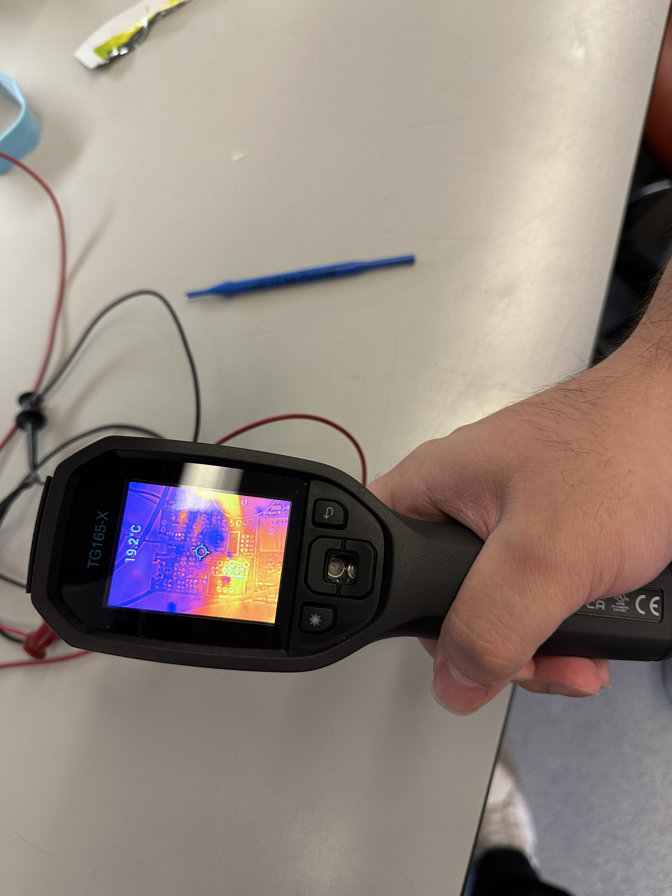

### d. The Altium Board design in 2D view

- 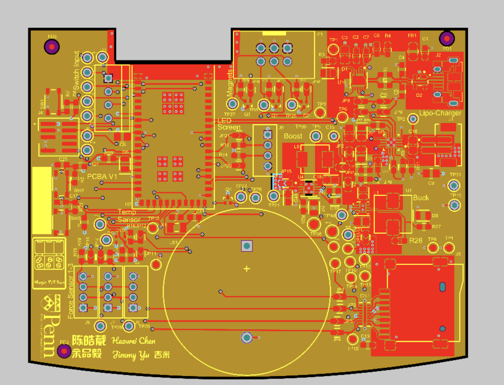
- 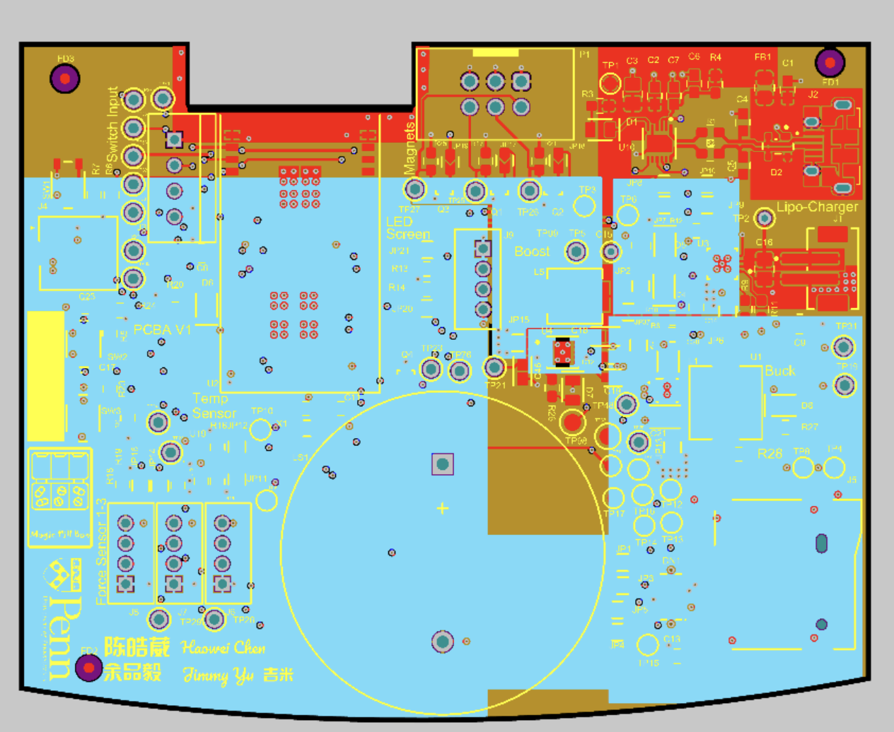

### e. The Altium Board design in 3D view

- 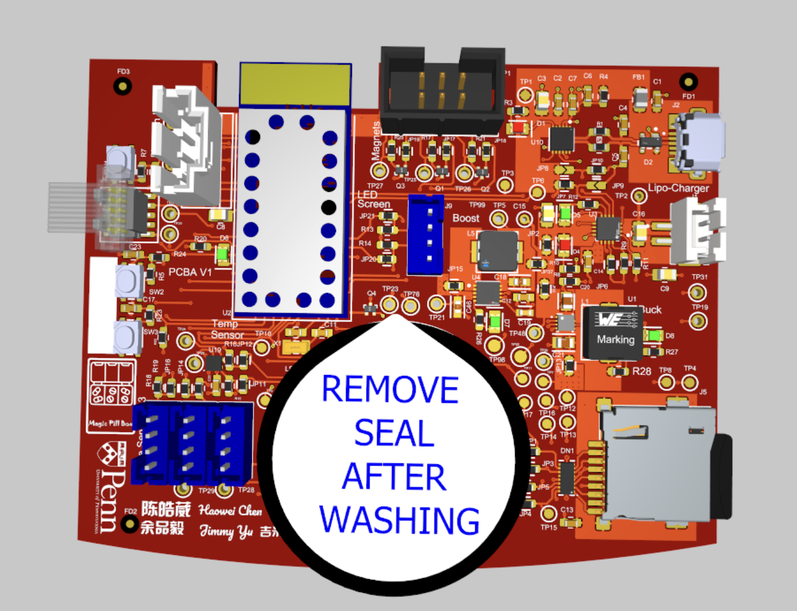

### f. Node-RED dashboard

- 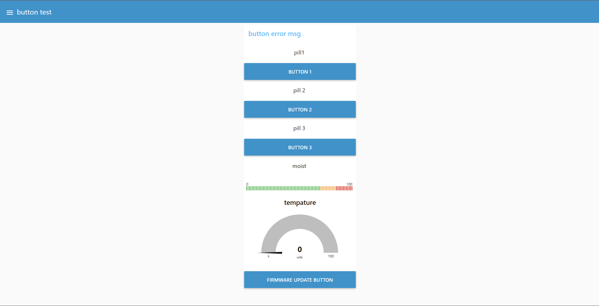

### g. Node-RED backend

- 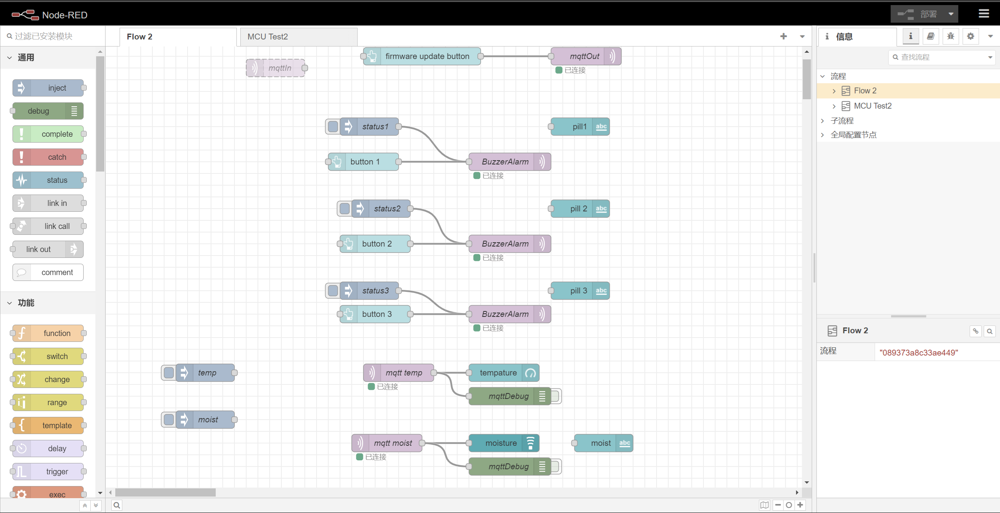

### h. Block diagram

- 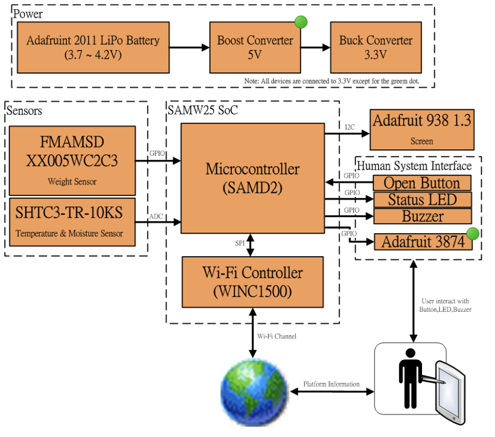
- 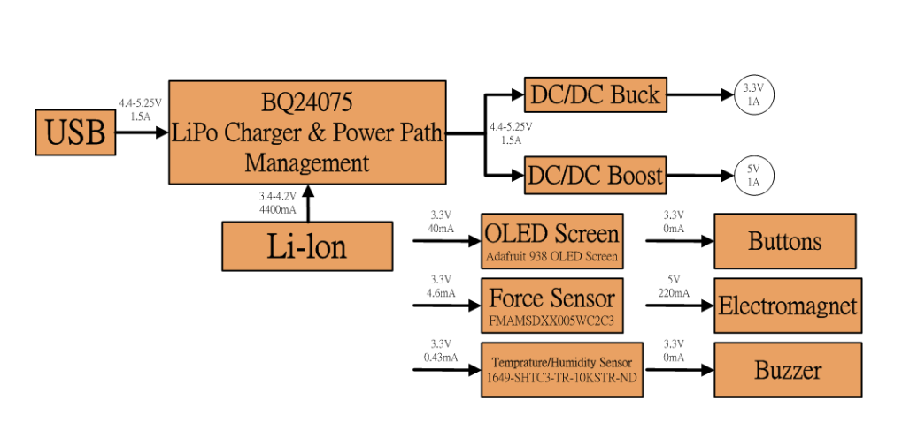